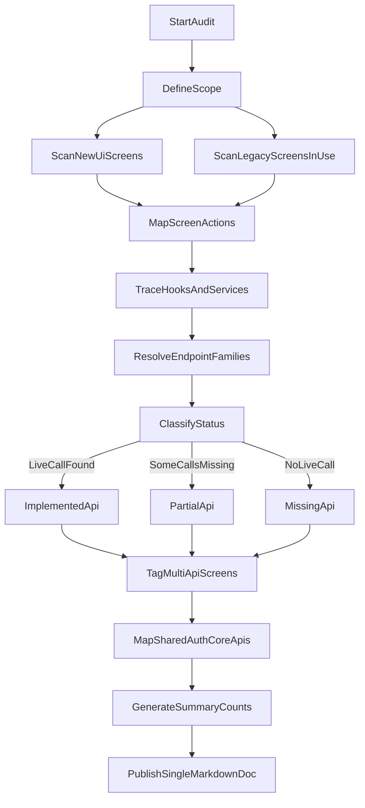

# New UI API Implementation Flow

This diagram defines how we will document API status for each screen (implemented vs pending), including multi-API screens and shared auth/core APIs.

## Mermaid Diagram

## Status Rules

- `ImplementedApi`: Screen has at least one runtime user-flow API/service call wired.
- `PartialApi`: Screen has some runtime calls, but one or more key actions are still local/mock/no-op.
- `MissingApi`: Screen has UI actions but no runtime API/service call wired.
- `MultiApiScreens`: Screen integrates two or more distinct API endpoints or mutations/queries.
