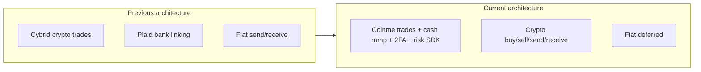

# PayAiro App — Current Development Brief (Crypto-Only, USA)

## Purpose of this document

Use this as **primary context** when working on PayAiro. It replaces the older “all-in-one fiat + crypto + IRA + RWA” summary. The **active product scope** is **US-market cryptocurrency only** (buy, sell, send, receive). Fiat banking, IRA, and RWA are **out of scope for now** (may return later).

**Scope of this brief:** Based on `payAiro-app/src/new-ui/` (~385 files, ~142 screen modules) plus navigators/hooks it depends on. Legacy screens under `src/screens/` still host some tab roots but **compose heavily from `@new-ui`**.

---

## Product positioning (current)

| Area | Current state |
|------|----------------|
| **Market** | United States |
| **Core offering** | Crypto buy/sell, crypto send/receive, retail cash ramp (Coinme) |
| **Fiat banking** | Deferred — not a launch focus; some legacy UI/API hooks remain |
| **IRA / RWA** | Not in active development |
| **Provider pivot** | **Coinme** replaces prior multi-provider setup (Cybrid for crypto trades; Plaid for bank link was in legacy flows) |

**Unique value today:** US crypto wallet experience with debit-card and **in-store cash** funding via Coinme retail network, P2P crypto transfers, and unified activity/history.

---

## What changed vs the old app summary



- **Buy/sell crypto:** `useCoinmeTradeExecute` → `api/v1/integrations/coinme/trade/execute/`
- **Cash buy (retail):** Location finder → order template → barcode screen
- **Cash sell (retail):** Multi-step sell flow → off-ramp execute → pickup code
- **Onboarding:** PayAiro OTP → **Coinme 2FA** (WebView) → KYC → main app
- **Cybrid:** Only legacy **legal checkbox** text on `KYCScreen.tsx` — not the trading provider
- **Plaid:** **No references under `new-ui/`**; one legacy “Link External Account” action in `DashboardActionButtons.tsx` points to a legacy Plaid screen

---

## Tech stack (unchanged core)

- **React Native** 0.81.x, **TypeScript**
- **State:** Redux Toolkit (auth/session), **React Query** (server state), MMKV persistence
- **Navigation:** React Navigation 7 — `AuthStack`, `AppStack`, 5-tab `BottomTabNavigator`
- **Push:** Firebase + Notifee
- **Security:** PIN, biometrics, app lock, JWT refresh
- **Environments:** Staging + production (`.env.staging` / `.env.production`)

---

## Repository layout for AI agents

```
payAiro-app/
├── src/new-ui/          ← NEW UI: screens, components, styles, navigationTypes
├── src/query/hooks/     ← React Query hooks (useCrypto, useCoinme*, useContact, …)
├── src/api/             ← endpoints.ts, clients
├── src/services/        ← coinmeRiskLifecycle.ts, Auth
├── src/navigations/     ← AuthStack, AppStack, BottomTabNavigator, constants
├── src/screens/         ← LEGACY tab shells (NewDashboard, Scans, NewPersonal) + some TSX-Screens
└── docs/new-ui-api-implementation-status.md  ← API wiring audit per screen
```

### Cursor rules (follow when editing)

- New UI work goes in **`src/new-ui/`** only (`.cursor/rules/payairo-new-ui.mdc`)
- Import alias: **`@new-ui/...`**
- Theming: **`useTheme`** from `@new-ui/styles/ThemeContext` + `*Styles(theme)` factories
- Extend `navigationTypes.ts` when adding routes
- Minimal comments — only non-obvious logic

---

## Navigation (5 tabs)

| Tab | Primary screen | Notes |
|-----|----------------|-------|
| Home | `src/screens/Dashboard/NewDashboard.tsx` | Legacy path; uses `@new-ui` balance card, crypto list, recent activity, contacts |
| Crypto | `new-ui/screens/Crypto/NewCrypto.tsx` | Market list via `useCryptoAssetsListData` |
| Scan | `src/screens/Scans/Scans.tsx` | Legacy; QR send path |
| Activity | `new-ui/screens/Activity/ActivityScreen.tsx` | Unified history |
| Profile | `src/screens/SettingScreen/NewPersonal.tsx` | Legacy settings shell |

**Auth flow (new-ui):** Onboarding → Login/Signup → OTP → **Coinme Mobile Auth** → KYC → (Address screen exists; routing may skip in signup) → main tabs.

---

## Coinme integration map

| Capability | Key new-ui locations | Backend / native |
|------------|---------------------|------------------|
| Trade execute (buy/sell) | `EnterAmount.tsx`, `NewAddBalanceScreen.tsx`, `CryptoWithdraw.tsx` | `COINME_TRADE_EXECUTE` |
| Debit cards | `AddDebitCardModal.tsx`, `PaymentMethodsScreen` | `PAYMENT_METHODS` + Coinme risk session |
| Cash buy (retail) | `CashRamp/LocationFinder/`, `CashRampBarcodeScreen.tsx` | `COINME_ORDER_TEMPLATE`, status poll |
| Cash sell (retail) | `CashRamp/Sell/*` | `COINME_CASH_OFFRAMP_EXECUTE`, pickup code |
| 2FA onboarding | `CoinmeMobileAuthScreen.tsx` | `COINME_2FA_MOBILE_AUTH`, `COINME_2FA_INSTANT_LINK` |
| Transaction limits | `TransactionLimitsScreen.tsx` | `COINME_TRANSACTION_LIMITS` |
| Risk / fraud | `services/coinmeRiskLifecycle.ts` | Native modules `PayAiroCoinmeRisk` (iOS/Android), env: `COINME_CLIENT_ID`, `COINME_PARTNER_ID`, `COINME_MODE` |
| Legal | `CoinmeAgreementScreen.tsx` | Static / Web content |

**Account ID:** `caas_customer_id` from `users/me` → `useCoinmeAccountId` hook; bootstrapped in `App.js` via `bootstrapCoinmeRisk` / `onUserLoggedIn`.

---

## Core user flows (implemented in new-ui)

### 1. Authentication and onboarding

- Phone/email OTP (`useUserOtpRequest` / `useUserOtpVerify`)
- Coinme 2FA WebView with fallback instant-link
- KYC submit (`useUserKycComplete`) — includes Cybrid agreement checkbox (legacy copy)
- Session resume logic in `authSession.ts` can land on Coinme auth step

### 2. Dashboard (Home)

- Crypto balances and market data (`useCryptoAssetsListData`, `useUserCryptoMarketList`)
- Recent transactions with trade + Coinme cash on/off-ramp formatting (`RecentActivityCard`)
- Quick actions: Send, Receive (crypto), Add Balance (buy)
- Contacts strip (`useUserContacts`)

### 3. Buy crypto

- **Debit card:** `NewAddBalanceScreen` → Coinme trade execute + risk `fetchWebSessionId`
- **Retail cash:** Amount → location finder (Google Places/map) → barcode / order template polling

### 4. Sell crypto

- **Debit card:** `CryptoWithdraw` or `EnterAmount` with `tradeMode: 'sell'`
- **Retail cash:** `navigateSellCashRamp` → location → amount → summary → OTP → pickup code wait

### 5. Send / receive crypto

- **Send:** `NewSend` → `EnterAmount` — `useCryptoTransfer` for on-chain/wallet sends; also supports payment requests (`useCreatePaymentRequest`, `usePayPaymentRequest`)
- **Receive:** `CryptoReceiveScreen.tsx` — `useWalletAddresses`
- **Legacy fiat receive:** `Receive.tsx` — Redux wallet/bank data; **not aligned with crypto-only product** (treat as legacy)

### 6. P2P / contacts

- `ContactsScreen`, `AddContactScreen` — wired to `useUserContacts`, `useDeviceContacts`, `useAddUserContact`
- `EnterAmount` uses `useUserToUserTransfer` for username/email P2P — confirm product intent vs crypto-only

### 7. Activity and limits

- Full history: `ActivityScreen.tsx`
- Coinme limits UI with live API

### 8. Security

- PIN/biometric gating via `useAppLock` before payments
- Encrypted storage, token refresh (app-level, outside new-ui)

---

## `new-ui` component inventory (high level)

**`components/common-components/`:** DashboardHeader, DashboardBalanceCard, CryptoAssetsList, RecentActivityCard, AddBalance modals (debit card, payment picker), SendContactsList, ScreenWrapper, CustomHeader, GorhomBottomSheet, layout primitives.

**`styles/`:** `ThemeContext`, light/dark themes, per-screen `*Styles.ts` under `styles/screens/`.

**`assets/svgs/`:** Tab icons and UI glyphs (`AppIcon`).

**Scaffolds / unused:** `new-ui/hooks/` (empty), `screens/Main/` (empty), `DashboardScreen.tsx` (mock — **not** the tab home).

---

## API surface (Coinme + crypto)

```
api/v1/integrations/coinme/trade/execute/
api/v1/integrations/coinme/order-template/
api/v1/integrations/coinme/order-template/status/
api/v1/integrations/coinme/cash-offramp/execute/
api/v1/integrations/coinme/cash-offramp/pickup-code/
api/v1/integrations/coinme/transaction-limits/
api/v1/users/me/coinme-2fa/mobile-auth/
api/v1/users/me/coinme-2fa/instant-link/
api/v1/integrations/crypto/market|balance|chart/
api/v1/wallets/addresses/
api/v1/integrations/payment-methods/
api/v1/integrations/locations/nearby/
```

Shared hooks live in `src/query/hooks/` — notably `useCrypto.ts`, `useCoinmeCashRamp.ts`, `useCoinmeTransactionLimits.ts`, `usePaymentMethods.ts`, `useAPIAuth.ts`.

---

## Implementation status (development level)

### Production-ready paths (API-backed)

- Auth OTP, Coinme 2FA, KYC bootstrap
- Coinme buy/sell (debit) on Add Balance, Enter Amount, Crypto Withdraw
- Cash ramp buy + sell flows
- Payment methods + debit card with Coinme risk lifecycle
- Crypto tab, receive addresses, activity history
- Transaction limits screen
- Contacts list and add contact

### Partial / mock / legacy (do not assume live backend)

| Item | Location |
|------|----------|
| Rewards | `RewardsAndReferralsScreen` — static balance |
| Notifications | `NotificationScreen` — hardcoded list |
| Bank statements | `BankStatementScreen` — UI only |
| Forgot password (new-ui) | Auth screens — APIs not wired per audit doc |
| Sell limit pre-checks | `sellLimitChecks.ts` — TODO, always passes |
| Google/Apple Pay | `AddNewCardPlaceholderModal` — “Coming soon” |
| `COINME_DEFAULTS` | Placeholder IDs in trade screens — replace with real selections |
| Fiat receive | `Receive.tsx` |
| Plaid link | `DashboardActionButtons` → legacy screen |

See `docs/new-ui-api-implementation-status.md` for per-screen API wiring.

---

## Explicitly out of scope (current sprint)

- Fiat send/receive, ACH, bank linking (Plaid), withdraw to bank
- IRA (Traditional / Crypto / Stock)
- RWA (real estate, stocks)
- MX Connect widget (dependency exists in package.json; not in new-ui)
- Scratch cards / vouchers (UI shells only)
- Multi-currency beyond USD display for crypto quotes

---

## Data model concepts (activity / trades)

Recent activity understands:

- **Trade rows:** `tradeType: buy | sell` with fiat + crypto amounts (USD default)
- **Coinme cash buy:** `source === "coinme_order_template"`
- **Cash off-ramp:** dedicated formatters in `RecentActivityCard`

Navigation from activity: `query/utils/navigateFromRecentActivity`.

---

## Build and run

```bash
npm run start          # Metro
npm run ios            # Simulator
npm run android        # Device/emulator
npm run ios:device:staging | ios:device:production
npm run android:staging:debug | android:production:debug
```

---

## Guidance for AI agents starting a task

1. **Confirm scope:** Is the task crypto/Coinme or legacy fiat? Prefer extending **new-ui** only.
2. **Trace the flow:** Screen in `new-ui/screens/` → hooks in `query/hooks/` → `endpoints.ts` → risk lifecycle if money movement.
3. **Do not reintroduce Cybrid/Plaid** for new features unless explicitly requested.
4. **Tab home** changes often touch `NewDashboard.tsx` **and** `@new-ui` components — keep both in sync.
5. **Test retail flows** with location permissions (Coinme risk SDK uses geolocation for card linking).
6. **USA assumptions:** USD fiat quotes for trades; US contact defaults in Add Contact.
