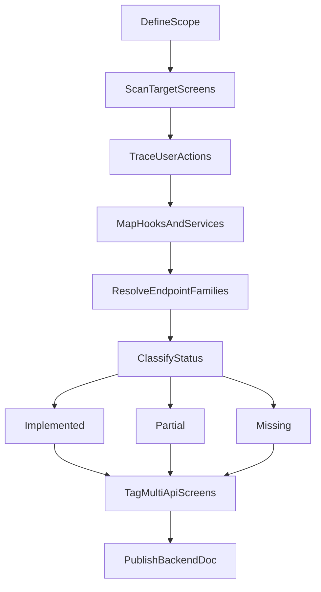

# New UI API Implementation Status

This document tracks API implementation coverage for `new-ui` and selected legacy screens currently used with the new UI.

## Classification Rule

- `Implemented`: runtime screen flow executes live API/service calls.
- `Partial`: some live calls exist, but key screen actions are still local/mock/no-op.
- `Missing`: no live API/service integration in expected screen actions.
- `Multi-API`: screen uses 2+ distinct query/mutation/service integrations.

## API Audit Flow

## Inventory Summary

- Total screens audited: `28` (`24` new-ui + `4` legacy in-use)
- Implemented: `17`
- Partial: `2`
- Missing: `9`
- Multi-API screens: `7`

> **Note:** Coinme cash-ramp, payment-methods, transaction-limits, and Coinme 2FA screens are wired in `AppStack` but are not yet rows in this matrix. See `docs/PROJECT_BRIEF_CRYPTO_USA.md` for the full Coinme surface map.

## New UI Screens Matrix

| Screen | Implemented APIs (hook/service) | Missing APIs / gaps | Status |
|---|---|---|---|
| `new-ui/screens/Auth/Login/LoginScreen.tsx` | `useUserOtpRequest` | None noted in primary login flow | Implemented |
| `new-ui/screens/Auth/CreateAccount/CreateAccountScreen.tsx` | `useSignUp` | None noted in signup OTP flow | Implemented |
| `new-ui/screens/Auth/OTPVerification/OTPVerificationScreen.tsx` | `useUserOtpVerify`, `useUserOtpRequest`, `useUserMe`, `useWalletDetails`, `useUserSecurityPinSettings` | None in core verification/bootstrap | Implemented (Multi-API) |
| `new-ui/screens/Auth/KYC/KYCScreen.tsx` | `useUserKycComplete`, `bootstrapMainAppSession` | None in KYC submit + session bootstrap path | Implemented (Multi-API) |
| `new-ui/screens/Auth/Address/AddressScreen.tsx` | `useUserAddressUpdate`, `useUserMe` | Not used in signup flow; screen kept for future profile use | Implemented (Multi-API) |
| `new-ui/screens/Auth/Onboarding/OnboardingScreen.tsx` | None | Onboarding completion/progress backend hooks missing | Missing |
| `new-ui/screens/Auth/ForgotPassword/ForgotPasswordScreen.tsx` | None | Forgot-password OTP request call missing | Missing |
| `new-ui/screens/Auth/ForgotPasswordVerification/ForgotPasswordVerificationScreen.tsx` | None | OTP verify/reset password or MPIN calls missing | Missing |
| `new-ui/screens/Activity/ActivityScreen.tsx` | `usePaymentTransactionHistory`, `useUserCryptoMarketList` | None for list load path | Implemented (Multi-API) |
| `new-ui/screens/Send/Send/NewSend.tsx` | `useVerifyUserByIdentifier` | None in identifier verification path | Implemented |
| `new-ui/screens/Send/EnterAmount/EnterAmount.tsx` | `useUserToUserTransfer`, `useCreatePaymentRequest`, `usePayPaymentRequest`, `useCryptoTransfer`, `useCoinmeTradeExecute`, `usePaymentMethodsList`, `fetchWebSessionId` | None in core send/request/crypto/trade actions | Implemented (Multi-API) |
| `new-ui/screens/Send/SelectPaymentMethod/SelectPaymentMethod.tsx` | Uses preloaded Redux state only | Fresh payment-method fetch for this screen context missing | Missing |
| `new-ui/screens/AddBalance/NewAddBalanceScreen.tsx` | `usePaymentMethodsList`, `useCoinmeTradeExecute`, `useUserCryptoMarketList`, `useWalletAddresses`, `fetchWebSessionId` | None in current add-balance trade path | Implemented (Multi-API) |
| `new-ui/screens/Crypto/NewCrypto.tsx` | `useCryptoAssetsListData` | None in asset list loading | Implemented |
| `new-ui/screens/CryptoReceive/CryptoReceiveScreen.tsx` | `useWalletAddresses` | None in receive-address loading | Implemented |
| `new-ui/screens/WithdrawCrypto/CryptoWithdraw/CryptoWithdraw.tsx` | `useCryptoAssetsListData`, `useCoinmeTradeExecute`, `usePaymentMethodsList`, `fetchWebSessionId` | None in withdrawal trade flow | Implemented (Multi-API) |
| `new-ui/screens/Receive/Receive.tsx` | None | Request/create receive-flow API missing in this screen | Missing |
| `new-ui/screens/KebabMenuScreens/SettingScreen/SettingsScreen.tsx` | None | Settings/profile preferences APIs not wired in this screen | Missing |
| `new-ui/screens/KebabMenuScreens/NotificationScreen/NotificationScreen.tsx` | None | Notifications list, read, preference update APIs missing | Missing |
| `new-ui/screens/KebabMenuScreens/BankStatementScreen/BankStatementScreen.tsx` | None | Statement fetch/filter/download APIs missing | Missing |
| `new-ui/screens/KebabMenuScreens/BankStatementScreen/ViewStatementScreen.tsx` | None | Statement detail/share/download APIs missing | Missing |
| `new-ui/screens/KebabMenuScreens/RewardsScreen/RewardsAndReferralsScreen.tsx` | None | Rewards/referrals summary/history APIs missing | Missing |
| `new-ui/screens/KebabMenuScreens/RewardsScreen/ScratchCardScreen.tsx` | None | Scratch claim/redeem APIs missing | Missing |
| `new-ui/screens/Contacts/ContactsScreen.tsx` | `useUserContacts`, `useDeviceContacts` | Device contacts require OS permission; search is client-side filter only | Implemented (Multi-API) |
| `new-ui/screens/Contacts/AddContactScreen.tsx` | `useAddUserContact` | None in add-contact submit path | Implemented |
| `new-ui/screens/Dashboard/DashboardScreen.tsx` | Some data appears from state/static composition | Dashboard widgets/actions still mostly static and not fully API-backed | Partial |

## Legacy Screens In Use Matrix

| Screen | Implemented APIs (hook/service) | Missing APIs / gaps | Status |
|---|---|---|---|
| `src/screens/Dashboard/NewDashboard.tsx` | `useCryptoAssetsListData`, `usePaymentTransactionHistory`, `useUserCryptoMarketList`, `useUserContacts` | Balance card widgets may still be static in parts | Partial |
| `src/screens/TSX-Screens/NewTransactionDetails/NewTransactionDetails.tsx` | None (detail-only screen) | No direct fetch/mutation in screen; depends on upstream data source | Missing |
| `src/screens/SettingScreen/NewPersonal.tsx` | None direct (reads auth slice state) | No direct refresh/fetch fallback if profile state is stale | Missing |
| `src/screens/Scans/Scans.tsx` | `useUserSearch` (recipient resolution on send QR camera path) | Gallery `send` path bypasses same resolution/validation flow | Implemented |

## Shared Auth/Core API Dependencies

- Auth OTP and profile bootstrap: `OTP_REQUEST`, `OTP_VERIFY`, `USERS_ME`, `KYC_COMPLETE`, profile/address update families.
- Crypto and wallet data families: `CRYPTO_MARKET`, `CRYPTO_BALANCE`, `WALLET_ADDRESSES`.
- Payment and transactions: `PAYMENT_TRANSACTIONS_SEND_HISTORY`, user-to-user transfer, payment request/pay flows, Coinme trade execute.
- Contacts: `USER_CONTACTS` (list/add via `useUserContacts`, `useAddUserContact`).
- Payment methods: `PAYMENT_METHODS`.
- Session/token support: `TOKEN_REFRESH` and risk/session helper flow (`fetchWebSessionId`) used in trade paths.

## Multi-API Screens (High Integration Complexity)

- `new-ui/screens/Auth/OTPVerification/OTPVerificationScreen.tsx`
- `new-ui/screens/Auth/KYC/KYCScreen.tsx`
- `new-ui/screens/Activity/ActivityScreen.tsx`
- `new-ui/screens/Send/EnterAmount/EnterAmount.tsx`
- `new-ui/screens/AddBalance/NewAddBalanceScreen.tsx`
- `new-ui/screens/WithdrawCrypto/CryptoWithdraw/CryptoWithdraw.tsx`
- `new-ui/screens/Contacts/ContactsScreen.tsx`

## Backend Priority Backlog

### High

- Forgot password flow APIs (`ForgotPassword`, `ForgotPasswordVerification`)
- Notifications APIs (`NotificationScreen`)
- Bank statement APIs (`BankStatementScreen`, `ViewStatementScreen`)

### Medium

- Rewards/referrals/scratch APIs (`RewardsAndReferralsScreen`, `ScratchCardScreen`)
- Settings screen data/action APIs (`SettingsScreen`)
- Receive request API wiring (`Receive`)

### Low

- Improve consistency in mixed paths (for example `Scans` camera vs gallery send validation flow)
- Replace remaining static dashboard blocks in legacy/new dashboard variants

## Notes for Backend Team

- Some screens are UI-ready but backend endpoints are not yet wired.
- Some screens intentionally depend on upstream data loaded in previous screens; those are marked `Missing` if they do not execute their own live call.
- For planning, prioritize high-risk user actions first (auth recovery, statements, notifications), then move to engagement features (rewards).
- Product scope is **US crypto-only (Coinme)**; see `docs/PROJECT_BRIEF_CRYPTO_USA.md` for current development context.
